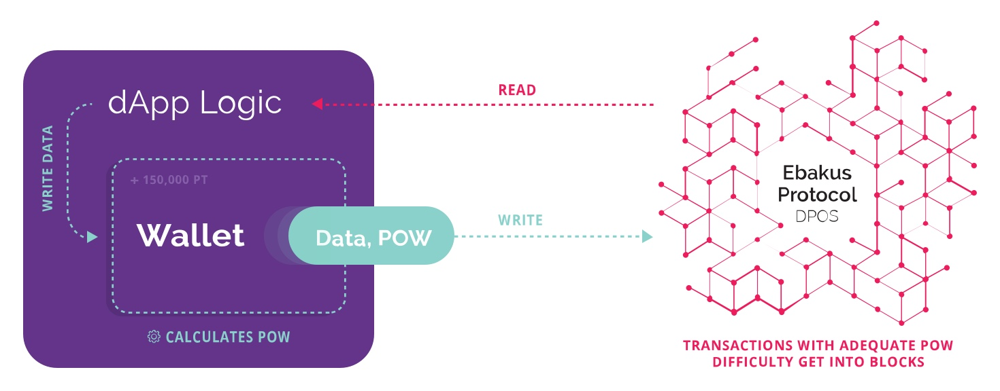

# Migrating your dApp from ethereum to ebakus

While ethereum has been a pioneer in the blockchain space by enabling dApp development through smart contracts, nowadays dApps built on ethereum are decreasing in popularity and dApp developers are researching other platforms like EOS and Tron, that reduce the latency and throughput problem found in Ethereum while improving on accessibility.

On this article we propose an alternative solution to Ethereum, EOS and Tron called ebakus, that further improves throughput and does leaps in terms of accessibility and usability. The best thing about ebakus is that it’s pretty forward to migrate your ethereum dApp to, or start developing a new dApp from scratch if you have prior experience with Ethereum. You can read more about ebakus [here](https://medium.com/ebakus/ebakus-focusing-on-mass-adoption-b32636c0abb4) and check how it compares as a platform to ethereum and EOS [here](https://medium.com/ebakus/building-dapps-ethereum-eos-and-ebakus-b0dbe8ef659).

This article will focus on onboarding ethereum developers to ebakus and will also act as a guide on how to migrate your dApp to ebakus.

## **Developing on ebakus for ethereum developers**

To remove friction for Ethereum devs, we designed ebakus to keep the ebakus node API to be the same as go-ethereum’s (**geth**) and to also be compatible with web3. The only substantial difference is that in order to send transactions through webjs you need to use our web3-ebakus wrapper that extends it with the functions needed to calculate the POW. This means that dev tools built for ethereum’s geth (like truffle) are also compatible with ebakus’ node and dApps that use web3 (web3 version >1.x) to interface with their smart contracts are plug and play with ebakus.

## **Improving accessibility and usability with ebakus’ web wallet**



To further remove friction with ebakus, we have implemented a web wallet in the form of a JS library. This wallet can be embedded inside a dApp and along with the “free” transactions model of ebakus, they provide a transparent (as far as the users are concerned) interface to the ebakus blockchain. The moment your dApp loads, the user is ready to interact with the blockchain.

To further improve experience we went a step further and developed a wallet loader library that creates an iframe and loads a hosted version of the ebakus web wallet in it. This way multiple dApps can share the same wallet drastically improving the UX while also strengthening security.

After downloading the wallet loader library from here all you have to do to load it in your project is to add the following in your dApp’s html:

```html
<body>
  <!-- Body content... -->
  <script type=”text/javascript” src=”wallet-loader.min.js”>
  </script>
</body>
```


If needed, you can then init the wallet with custom tokens with the following:

```javascript
<script>/* you can listen for `ebakusLoaded` event in order to know when wallet is ready */window.addEventListener(
  ‘ebakusLoaded’,
  (ev) => {
    console.warn(‘Ebakus Wallet loaded!’)
    /* loading custom token to wallet */
    ebakusWallet.init({
      tokens: [{
      contract_address:‘0xa679d48c57320e9f0eadb043c3ea3f8dcd97ed01’,            
      symbol: ‘SIM’,
      decimals: 18,
      }]
    })/* Additional code */</script>
```

After loading it, you can easily interface with the wallet through javascript the following functions:

- ebakusWallet**.getDefaultAddress()**
  as the name suggests, this function returns the wallet’s address. (Current version of the webwallet only supports one address.)
- ebakusWallet**.getBalance()**
- returns the wallet’s address’ current balance in wei
- ebakusWallet.**sendTransaction(tx_object)**
  calls the wallet with a transaction object (**tx_object**). Your tx object here is the same as you would use it for ethereum. The wallet handles calculating POW, before sending the tx, in the background.
- ebakusWallet.**suggestDifficulty(account_address)
  **Returns the suggested target difficulty for your account taking into account your accounts stake and network congestion conditions.

## **Further optimizations**

You may further want to optimize your dApp’s code to take advantage of ebakus’ lower latency(1 sec) and to leverage ebakusDB. EbakusDB allows you to use schema defined tables, with indexes that allows handling large datasets with ease. EbakusDB integration to EVM is already implemented and active in our testnet and an article describing how you can utilize it, is in the works. If you feel adventurous feel free to check out [this **indie leaderboard repository**](https://github.com/ebakus/indy-leaderboard) where we implement a leaderboard-achievements solution running completely decentralized on ebakus, leveraging ebakusDB.

You can download and play with our boilerplate [here](https://ebakus.com/assets/ebakus_devkit.pdf)

You can also further study **a real world migration example** of an ethereum [dApp](https://demo.ebakus.com/) to ebakus [**here**](https://github.com/ziogaschr/nifty-game/commit/6fe8ecce30cca567d58ee3b30ce9df3978c03cee)