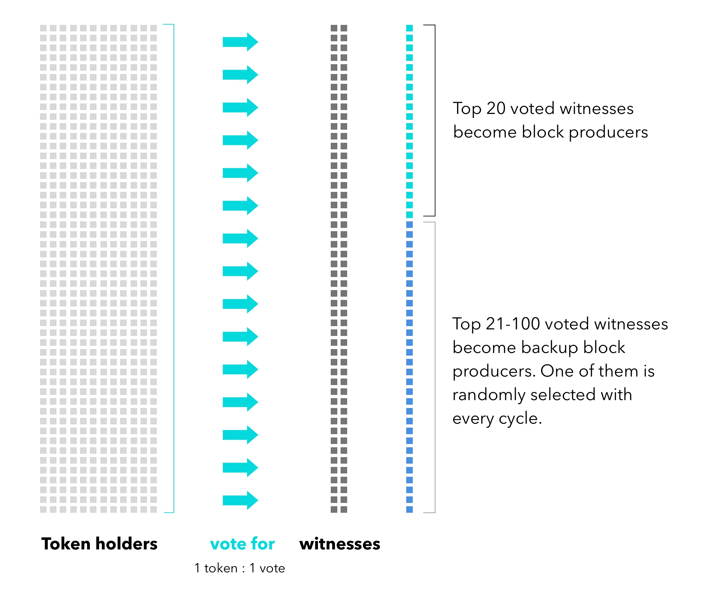
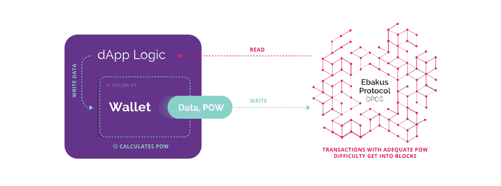

# Introduction to ebakus

The ebakus development stack allows developers to create highly responsive and frictionless decentralized applications that are a delight for users to use.

The backbone of the ebakus development stack is the ebakus blockchain. It is fast, it has free transactions while remaining sybil resistant and is 100% backwards compatible with ethereum's go-ethereum node. This means that everything you have built for ethereum can be easily ported to work with ebakus.

Besides the performance and accessibility improvements, ebakus also extends Solidity with ebakusDB. A decentralized transactional database that makes handling of large datasets a breeze. It supports tables with multiple indexes and allows to sort large datasets fast and easy.

##  DPOS consensus

Ebakus owes its low latency and high throuput to the Delegated Proof of Stake (DPOS) consensus algorithm that was originally introduced by Dan Larimer and first brought into production in bitshares.

In DPOS the blocks are produced by the *block producers,* which are elected through a continuous approval voting system. Block producers are selected among a number of nodes willing to produce blocks called *witnesses*. Anyone can choose to become a witness, but only those that accumulate the most votes acquire the right to produce blocks. The voting power of each stake holder in the network is proportional to their stake -the number of tokens they hold- in the network. This creates a significantly more agile and attack resilient system than POW. A DPOS system can quickly heal in the events of byzantine actors trying to manipulate the network.

Ebakus has 21 block producers,

* the 20 top voted witnesses become block producers
* the 21st is randomly selected by the top voted 21-100 witnesses to incentivise them to run their infrastructure and make sure that backup block producers are available.

The ebakus blockchain by default produces one block every second and at each second only one producer has the authority to produce a block.

## Free transactions

One of the main reasons we decided to built ebakus was to improve usability of decentralized applications. When we started looking into viable business models and ideas for dApps, we quickly found out that fees and complex resource management systems really hindered usability. The requirement for users to own an initial token balance in order to interact with decentralized applications was really hurting onboarding of new users that had no previous experience with blockchain applications and it was one of the first problems we built ebakus to solve.

Blockchains today use fees in order to achieve two main goals. First, to mitigate malicious unsolicited flooding of the network with a huge number of transactions in order to affect the quality of service for normal operations, and use up storage and processing capacity. Second, to incentivise the miners or block producers as they collect those fees.

Adding fees to every transaction greatly hinders the usability of a blockchain. One of our main design goal with ebakus software is to provide free transactions. We do this by solving the two aforementioned problems. We solve the incentive problem by using inflation. The block producers don’t depend on the fees of transactions as the software constantly creates new ebakus coins as a reward for them. So now, we have to address the spamming of the network in order to make the inflation truly compensate for the lack of fees additionally to maintaining the quality of service.

We achieve this by utilising an algorithm that uses proof of work in combination with proof of stake. The initial invention of PoW was actually for use in mitigating network denial of service. Most blockchains ended up using fees in order to make it expensive to attack the network, while killing usability and eventually failing to maintain quality of service.

In ebakus  the network maintains a PoW quantum value. This is the minimum work required by a non stake holder -we will come back to that- for the unit operation on the network. Each operation on the network requires to consume a number PoW quanta in order to be accepted depending on the complexity of computation, the storage requirements, etc. The block providers adjust this PoW quantum to the level that allows normal operation of the network. For example if the network is idle with very little transactions being processed, transactions will require very low PoW to be accepted. In the event someone starts spamming the network with transactions the PoW quantum will be increased so it becomes computationally expensive for him to continue doing so.

However, in order to achieve quality of service for the legitimate users of the network ebakus does not operate entirely on the global PoW quantum. The global PoW quantum essentially the work quantum required by accounts holding zero amount of ebakus coins. The actual work quantum accepted is adjusted for each account as a function of its stake. Accounts that hold more ebakus coins -and hence have more stake- have a lesser PoW quantum.

The PoW quantum is adjusted in a way that, at anytime, the network resources are allocated proportionally to all the stake holders sending transactions.

Ebakus wallets will be able to recalculate the PoW required to send a transaction, so even in cases that the account has zero stake and the network is congested, the user experience will be smooth.

## The EBK token

The ebk token is the native token of the ebakus network, its main uses are

* to vote for block producers and secure the infrastructure of the network
* to be staked and allow clients to do less proof of work in order to send transactions to the network

## ebakusDB

Each smart contract in ebakus has its own schema defined database (ESDD). This database can support any number of tables with typed fields and indexes. A smart contract is able to perform the following operations on the data:

1. Create/Drop tables
2. Create/Drop indexes on specific fields
3. Retrieve/update/delete single or multiple rows of data
4. Do ordered range queries on these data

The ebakus software makes sure that the data are stored in such a way in order to support the above operations in the most efficient way. The smart contract should not need to implement most common query types by itself.

The EbakusDB layer is providing to the ebakus blockchain a very fast database layer that supports O(1) time and space complexity snapshots. This is essential to the operation of a blockchain system that has requirements for querying old block states. The database achieves high performance by being aware of the transactional log functionality that the layer above it is using and not reimplementing it itself. Therefore achieving ACID compliance without sacrificing performance.

Smart contracts deployed in Ethereum compatibility mode will not be able to make use of the ESDD, hence will not be able to benefit from the extra functionality and performance. Bellow you can see how ebakusDB performs compared with Google's LevelDB. 

## The ebakus development stack

The ebakus development stack consists of

- **the ebakus node:**
  DPOS, 1 second blocks, ebakusDB

- **web3-ebakus:**
  is an extentention of ethereum's popular web3 library to enable calculation of PoW and access ebakusDB

- **the wallet-loader library:**
  can be included on any static site and provide an interface to the ebakus blockchain through the web wallet.

- **the ebakus web wallet:**

  Is the interface to the ebakus network.

The ebakus development stack allows for applications that are s easy to use as any other application built on centralized infrastructure while remaining completely decentralized (without the need to rely on hybrid models).  Besides the speed, the key to achieving great UX is avoiding transaction costs either in the form of fees or complicated resource systems, while also remaining sybil resistant.

## Building on ebakus

ebakus is quite easy to pick up especially for ethereum and tron developers try our [getting started with ebakus development article](./developing-applications-with-ebakus/gettting-started-with-ebakus-development.md) to familiarize yourself with the ebakus development stack and start building apps in no time.
